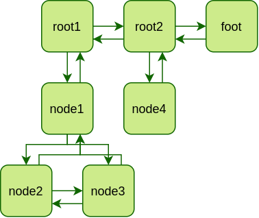

# k_tree


# What is it
Library for making tree data structure with arbitrary nubmer of children per node. Inspired by [tree.hh](https://github.com/kpeeters/tree.hh)

Basically, k-tree looks like this:



You can add as many roots, hodes and their children as you want and then iterate through them depth-wise or breadth-wise.

# Integration
It's templated header-only library due to reasons, so basically all you need to do is:

```sh
#in your project dir
git submodule add https://github.com/tort-dla-psa/k_tree.git submodules/k_tree
```
```cmake
#in CMakeLists.txt
include_directories(submodules/k_tree/include)
```
```c++
//in your code
#include "k_tree/k_tree.hpp"
```

Or just copy and include k_tree.hpp in your code.

# Usage

```c++
k_tree::tree<int> t; //create empty tree
auto it = t.set_root(0); //set it's root (obviously) and save depth-first iterator to it
t.insert_left(it, 1); 
it = t.insert_right(it, 2);
t.append_child(it, 3);
t.prepend_child(it, 4);
/* this will create following tree:
   1-0-2
      / \
      4-3
*/
```

There are already a good examples in [tests](tests) directory.

# Used in
[logicsim](https://github.com/tort-dla-psa/logicsim) - simulator of logic circuits by me.

If you used this library in your code and want it to appear in this list, open an issue.

# Contributors
Just me yet
